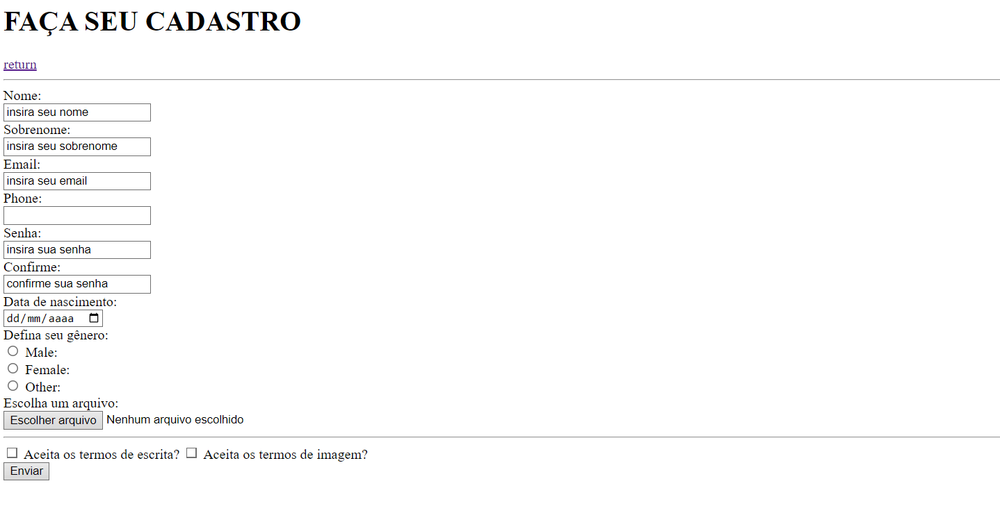
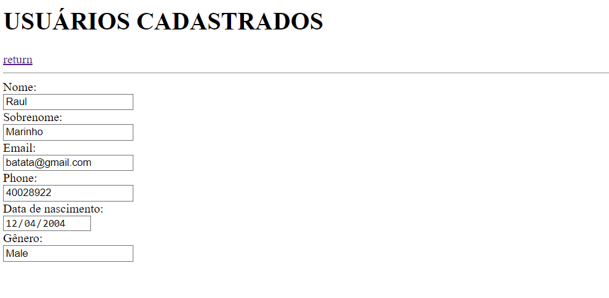
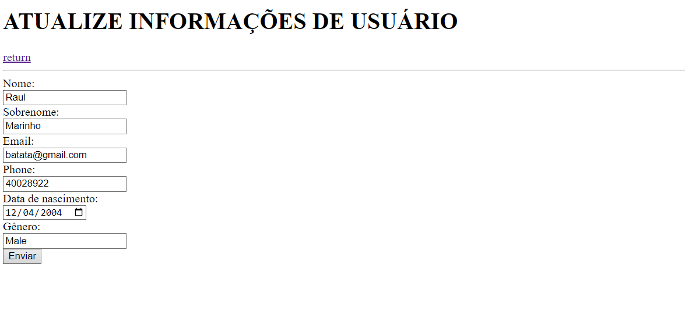
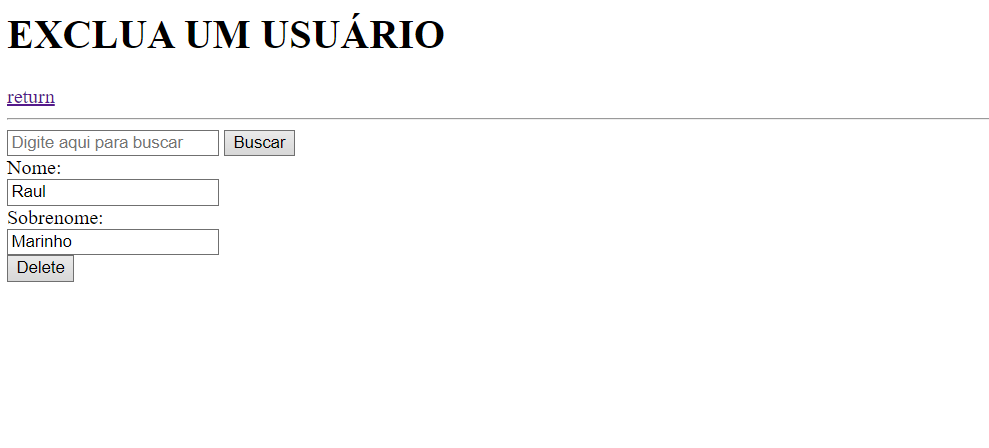

# HTML-practice-forms
This is an exercise in practicing HTML form elements,Below are images of the pages:

01. Index.HTML

02. cadastro.HTML

03. leitura.HTML

04. atualiza.HTML

05. exclusao.HTML

